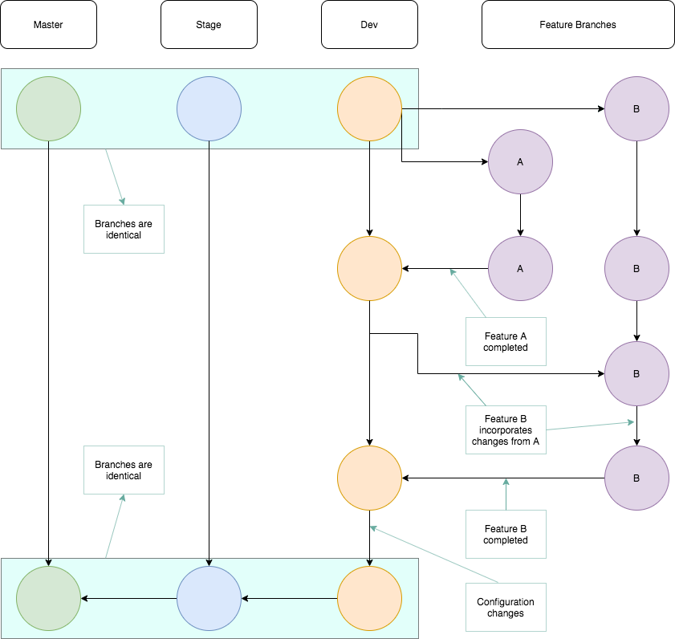

## Git Workflow for Small Teams
This post shares a slim git workflow that may be useful for those working on small, collaborative teams with short iteration cycles.  
  
For consistency, the recommendations in this post are rigid; however, the workflow could be easily adjusted to meet alternate needs.
  
### Getting Started  
The workflow consists of three persistent branches:
 
* **master**: A typical master branch that is installed by end-users.  
* **stage**: The branch used to ensure a package is ready for deployment. Ensure the package builds successfully, CI/CD pipelines are functioning, and any other operational workflows are ready.  
* **dev**: The branch used to merge features and ensure software tests execute successfully.
  
**Feature branches** are branched from **dev** and are where code-changes actually happen.

### The Workflow  
  
 

  
### General guidelines
* It is necessary to have a project expert who is in charge of ensuring the correct code changes occur when merging features into **dev**. 
* Upon a merge to **master**, the master, stage, and dev branches should all be identical. This is achieved by merging an identical copy of dev --> stage and stage --> master.
* Software functionality changes do not happen in **dev**. The only commits in dev should be merges from feature branches and configuration changes (e.g. updating the version).

### Useful Links
* [Another Git Workflow](https://nvie.com/posts/a-successful-git-branching-model/): A git workflow from which I drew ideas. This workflow is more intricate, but can handle more complicated collaboration.
* [Merge Exact Copies](https://stackoverflow.com/questions/2763006/make-the-current-git-branch-a-master-branch): How to merge an exact copy of one branch into another.
* [Resolving Merge Conflicts](https://stackoverflow.com/Questions/161813/How-to-Resolve-Merge-Conflicts-in-Git): Different tips and tools for handling merge conflicts from the command line.
* [Comparing Branches](https://stackoverflow.com/questions/31982954/how-can-i-check-whether-two-branches-are-even): Checking if branches are 'even'. Useful discussion about comparing files vs. comparing commits. 

