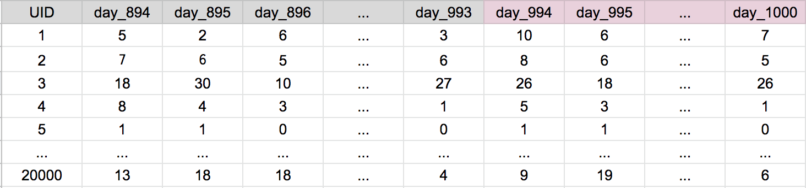

## Predicting Time Series
This post outlines basic strategies for predicting time-series problems using machine learning.  
  
Although simple, these ideas have been at the core of the model building proccesses for a majority of the top solutions in Kaggle competitions such as [M5 Walmart Sales](https://www.kaggle.com/c/m5-forecasting-accuracy/) and [Corporacion Favorita](https://www.kaggle.com/c/favorita-grocery-sales-forecasting).

### Problem Type
In a typical  time-series problem, you are given N series consisting of T data points. This data can be represented in a N x (T+1) matrix, with one column reserved for a primary key to identify the nth series. Here is an example problem:  

Suppose we are given 1000 days of historical sales data for 20000 items sold on a large online retail store. We are tasked with predicting sales for each item 7 days into the future. The data is represented in the 20000 x 1008 table below:

### Training Data

We use portions of historical sales as truth sets and the corresponding previous days as features. In the example below, we use the first 100 days of item sales as the features (grey), and the subsequent 7 days as truth values (purple):  

We can build out many sets like this one in order to increase our total training set size:

When creating the training data, you will encounter several dilemmas including:  

* How much training data should be created? Above, we created 60,000 rows, and have the possibility of creating 19.86M rows (993 * 20,000).
* Should each truth set begin on the same day and match the final test set? For example, if day 1001 is a Monday, should the first day of each truth set also begin on a Monday?
* How can we feature engineer the training set?

Training data in time series is explored further in [this blog post](https://github.com/npa02012/blog_posts/tree/master/ts_training_data).

### Model Building

Following are two model buildling approaches that I have seen used successfully in Kaggle competitions:

##### The Recursive Model Approach
In the recursive model approach, we build a single model which is able to predict one day into the future. We then use our predictions as feature data to predict the subsequent days. In our example, we would use our predictions of days 1001 &#8594; 1006 to predict day 1007.  

I used the recursive approach in the Walmart Sales competition to predict 28 days into the future. [Here](https://github.com/npa02012/kaggle_walmart_sales) is a blog post I made for my work in that competition.

##### The Many-Models Aproach

In the many-models approach, we build one model for each day into the future that we are tasked to predict. In our example, we would build a total of 7 models. The 'first' model would predict one day into the future, while the 'seventh' model would predict 7 days into the future.

I used the many-models approach in the Corporacion Favorita competition to predict 16 days into the future. [Here](https://www.kaggle.com/npa02012/ceshine-s-lgbm-starter-in-r-lb-0-529) is a script I published for that competition.

##### Other approaches

This post only considers using 'standard' machine learning libraries such as LightGBM, CatBoost, or randomForest. Take note that neural nets provide more flexibility with how time-series can be modeled. [Here](https://github.com/sjvasquez/web-traffic-forecasting) is one such example of using CNNs to model web-traffic data.  
