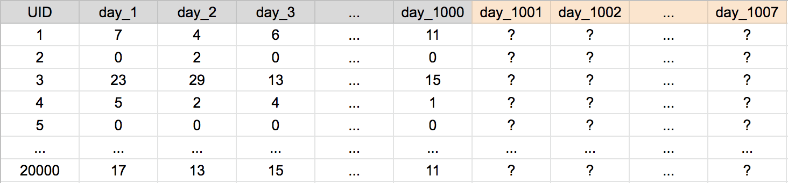
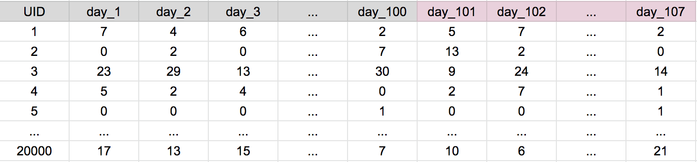

### Predicting Time Series
This post outlines basic strategies for predicting time-series problems using machine learning.  
  
Although simple, these ideas have been at the core of the model building proccesses for a majority of the top solutions in Kaggle competitions such as [M5 Walmart Sales](kaggle.com) and [Coorpacion Favorita](kaggle.com).

### Problem Type
In a typical  time-series problem, you are given N series consisting of T data points. This data can be represented in a N x (T+1) matrix, with one column reserved for a primary key to identify the nth series.  
  
To make this post easy to write and read, an example problem is provided:  

Suppose we are given 1000 days of historical sales data for 20000 items sold on a large online retail store. We are tasked with predicting sales for each item 7 days into the future. The data is represented in the 20000 x 1008 table below:

### Training Data

We use portions of historical sales as truth sets and the corresponding previous days as features. In the example below, we use the first 100 days of item sales as the features, and the subsequent 7 days as truth values:  

We can build out many sets like this one in order to increase our total training size:

When I am creating these models, I identify each set of data with a FIRST\_PRED\_DAY tag, i.e. the training data consisting of the first 100 days of data is identified with FIRST\_PRED\_DAY = 101.  
  
Here are two things to consider as you are creating this data:

* How much training data should I create? In this example problem, we could potentially make over 35M rows of training data (1793 * 20000). In the Walmart Sales competition, pushing the training data towards the maximum possible size improved the validation score in my model and on several public kernels. On the otherhand, this technique worsened my validation score in the Coorporacion Favorita competition. The worse results may have been due to a lack of model hyperparameter tuning or over-fitting as the in-training validation set was too similar to the training set. In either case, I recommend trying both ends of the training-size spectrum.  
* Consider keeping the FIRST\_PRED\_DAY's of the training set as the same weekday as the final test FIRST\_PRED\_DAY. In this example, the final test set has a FIRST\_PRED\_DAY of 1001. Let's say this falls on a Monday. If we want our training sets to have a FIRST\_PRED\_DAY that also falls on a Monday, we will have to use values such as 994, 987, 980, and so forth. Clearly, this method captures weekly seasonality and is worth investigating - especially if memory/system constraits limit potential training size.  

### Model Building
This post only considers using 'standard' machine learning libraries such as LightGBM, CatBoost, or randomForest. Take note that neural nets provide more flexibility with how time-series can be modeled. [Here](sjv link) is one such example of using CNNs to model web-traffick data.  

