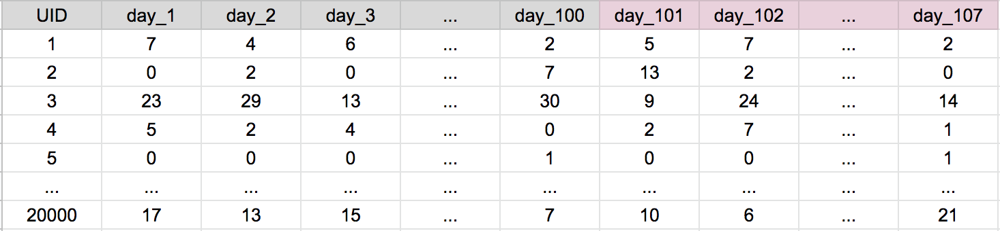

## Time Series Training Data

In my [Time Series](https://github.com/npa02012/blog_posts/tree/master/time_series) blog post, I outline some basic concepts of approaching time series machine learning problems. This post is a continuation which outlines some practices and insights I have gathered regarding the training data. I think this topic deserves it's own post as, in my experience, upwards of 90% of development time can be focused on cleaning data, feature engineering and building a training data generator function.

### Data Organization

As in the prevoius post, we are assuming we have 1,000 days of historical data sales for 20,000 items and are tasked with predicting sales 7 days into the future.  

I typically keep my data in a wide format:


I have seen many people melt the dataframe in competitions. Melting the dataframe allows use to leverage the pandas **shift** function ([example](https://www.kaggle.com/ragnar123/very-fst-model)) or R's data.table **frollmean** function ([example](https://www.kaggle.com/craving1030/lb-0-488-lgb-with-r)). Furthermore, melting a dataframe can potentially alleviate memory issues - particularily if you are dealing with a sparse dataset.  

In my opinion, keeping the data wide provides a more intuitive approach to the problem, and furthermore, is easier to debug.

### Feature Engineering

As in the [Time Series](https://github.com/npa02012/blog_posts/tree/master/time_series) blog post, suppose we are designing our model to use 100 days of historical data to predict 7 days into the future. Then following is our 'first' training dataset:



This gives us 20,000 training data rows to feed a machine learning model. We, however, probably do not want our features to only be raw sales.  

The 1, 7, and 14 day historical lag sales volume is worth investigating to be features (day\_99, day\_93, and day\_86 respectively). On the other hand, the 100 day historical lag sales probably won't add much to your model. Here is some psuedo-code:

```python
def get_lag_sales(df, first_pred_day):
	'''
	Function to get previous 1, 7 and 14 day sales
	Params:
		- df : dataframe containing 108 columns
		- first_pred_day : (int) Day # of df for first testing day
	'''
	col_names = 'day_' + (first_pred_day - [1, 7, 14])
	new_features = df[col_names]
	rename_columns(new_features, 'lag_' + [1, 7, 14])
	return(new_features)

df_100 = df_all['day_' + [1:107]]
features_100 = get_lag_sales(df_100, 101)
```

At this point, our training data will look like the following:  


Where **F_1** &#8594; **F_7** will be your *y_train*. I implemented this type of logic [here](https://github.com/npa02012/kaggle_walmart_sales/blob/master/scripts/fe_functions.R#L13) for the Walmart Sales Kaggle Competition.  

In the pseudo-code, you can see that we can easily and intuitevely capture the columns we want by referring to the column names. Obtaining the same features with a long dataframe would require a *group_by* and *shift*.  

Following is some more pseudo-code to generate mean sales of the previous 3, 10, and 20 days:  

```python
def get_mean_sales(df, first_pred_day):
	new_features = None
	n_days = [3, 10, 20]
	for n in in_days:
		col_names = 'day_' + (first_pred_day - [1:n])
		new_features.append(row_means(df[col_names]))
	return(new_features)

df_100 = df_all['day_' + [1:107]]
features_100.append(get_mean_sales(df_100, 101))
```

Now, our training data will look like the following. Note that the *mean* columns will not be integers even though historical sales are always integers:


This framework provides a lot of flexibility for creating features. Here are some other interesting features I have used:  

* Variance of historical sales
* Mean sales by day of week
* Lagged, rolling mean sales
* Non-zero days, mean sales
* Number of zero day sales

### Expanding Training Data

TODO


